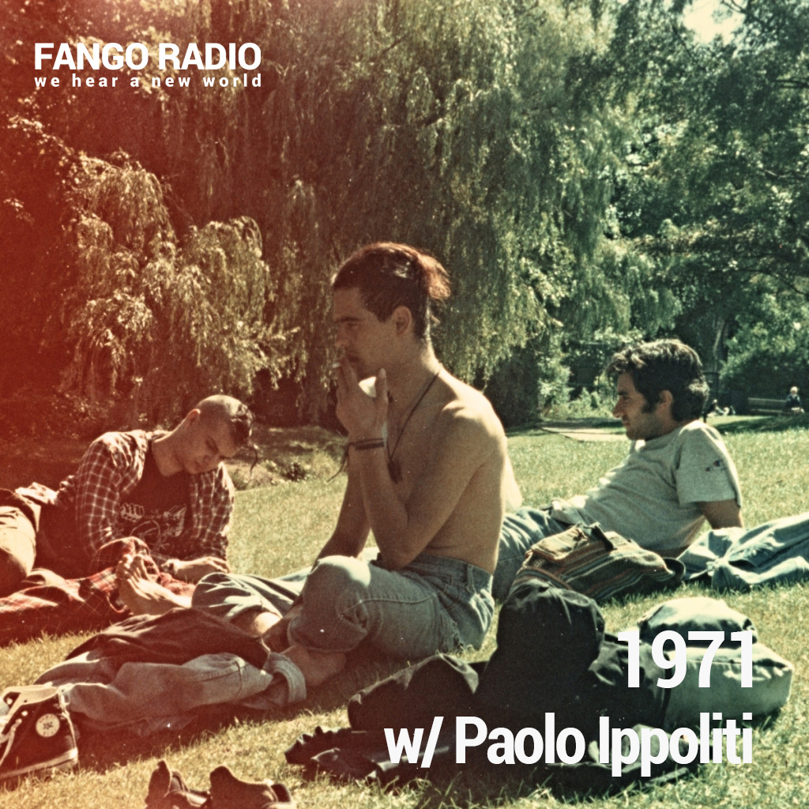
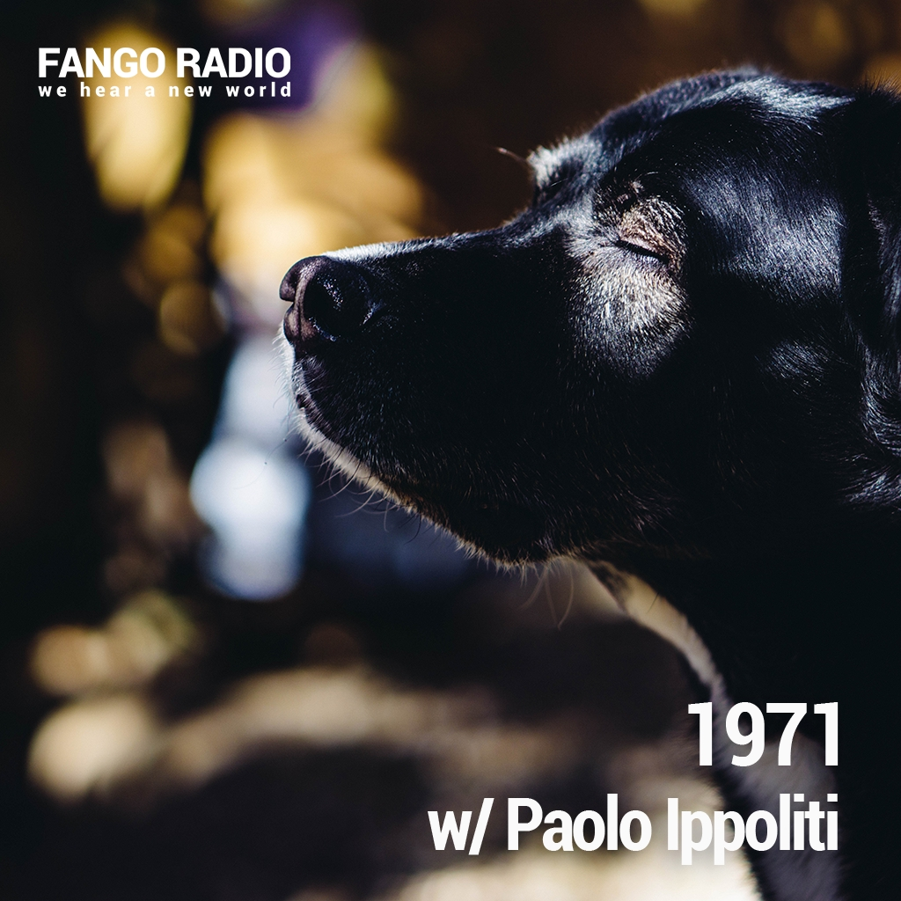

1971 è un programma radiofonico che da maggio 2024 va in onda a cadenza mensile su [Fango Radio](https://www.fangoradio.com/shows/346), nel corso del quale, come recitano le info, *diramo nell’etere mix registrati in presa diretta col fiato sospeso su quattro deck in fiamme col miraggio di distorcere spazio, tempo e percezioni*: in sostanza, si tratta di coacervi di edit e mashup di suoni altrui impilati a densità vertiginose, in mezzo ai quali finiscono occasionalmente spezzoni dal mio archivio acustico. l'operazione di assemblarli, senza preparazione o precogito alcuno, con per farlo grosso modo il solo tempo della loro durata e un gran confidare nella Dea Fortuna, mi ricorda da vicino i tempi (e i concerti) dei [Logoplasm](https://www.discogs.com/artist/199803-Logoplasm). come ho già scritto da qualche parte nella colonna dei diari, nel suono ho ritrovato un prezioso alleato.

riporto qui come archivio e perché l'emittente non offre modalità di embed le trasmissioni complete di schede man mano che sorgono al mondo.

-----

**1971 // 001 — *tutti questi anni senza nemmeno un volto***

<media-theme-sutro-audio
  style="--media-primary-color: #ffffff; --media-secondary-color: #000000;"
>
  <audio
    slot="media"
    src="https://pantano.ovh/upload/1971/2024-05-14-001/2024-05-14-001.mp3"
    playsinline
    crossorigin
  ></audio>
  <media-poster-image
    slot="poster"
src="paoloippoliti-1971-001-th.jpg">
  </media-poster-image>
</media-theme-sutro-audio>
	

La parola *esordio* deriva dal latino *exordiri*,  che alludeva all’aver dato inizio a una tessitura — l’aver appunto  sistemato l’ordito sul quale poi s’andava a intessere la trama. questa è la prima puntata di **1971**, di fatto l’esordio della trasmissione: l’ordito è proprio *ex* nel senso di svanito, e anche la trama si è già dispersa in uno  sfilaccio di supernova; delle tracce che la compongono restano al più  brandelli e vecchi fotogrammi sovraesposti o troppo fiochi per poter  essere distinti. La lista delle stesse è stata ricostruita a memoria  durante il riascolto, va considerata parziale e indicativa soltanto  della sequenza d'ingresso nel mix: è quasi tutto accavallato,  rallentato, distorto e illusoriamente percepito, proprio come fosse un  normale giorno sulla Terra.  
Si consiglia un volume assordante.  
Buon ascolto.

<h6>To describe a <i>debut,</i> Italian language uses the word <i>esordio,</i> which shadows the Latin *exordiri,* the act of setting the weft over which a warp will be spun. This is the first episode of b>1971/b>, its actual debut: the weft is gone, and as the warp approaches its  supernova state all we ever hear of the tracks that weave it is tatters  at best, old overexposed photographs too dim to be told apart. A list of the same has been rebuilt from memory upon relistening and is thereby  to be considered partial and as a measure of their sequence of entry  into the mix: everything is overlayered, slowed down, overblown and  illusorily perceived, just like a normal day on Earth.  
Play loud.  
Enjoy.</h6>

*******************************

TRACKLIST

> - Geotic - The Men-Shaped Fog
- Giuseppe Ielasi - 4
- Ken Thorne - The Tengu Mask/Breaking The Mask/You Must Go
- Ana Costa - Entre Olhos
- Bernard Parmegiani - Flash sports
- Amaro Freitas - Mapinguari (Encantado da Mata)
- Cergio Prudencio - Tríptica
- Amaro Freitas - Uiara, Vida e cura (Encantada da Água)
- David Shea - The Sirens
- Belmont Girl - Through Your Gills I Breathe
- Fred & Regina Guimaraes - Ainda Há Mestres Do Arrependimento?
- Infinity Machine - Luminous Body
- Salami Rose Joe Louis - Don’t Do Anything Stupid
- Micachu - Chopped & Screwed Interviews
- Nate Scheible - Reproof of fancy games
- Oren Cantrell - Charzhou for Kerki
- Ben Frost - Load up on Guns, Bring your Friends
- Rag Mother - Unreleased/Untitled
- Florian Störtz - Libera me
- Future & Lil Uzi Vert - Moment of Clarity
- Qendresa - Hypnotised
- Strange Boy - Drunk In Iceland
- Andrea Piccioni - Kira
- .300 Whisper - Inhumanity & Justice (Instrumental)
- Luis Barrie - I he a Hotu Matu'a
- Gunter Herbig - As If The Stormy Years Had Passed
- Daniel Schmidt & The Berkeley Gamelan - And The Darkest Hour Is Just Before Dawn
- Yarn/Wire - Points on a Colored Spiral 1/Little Jimmy
- Xấu - Khánh Jayz x 2Can 

-----

**1971 // 002 - per un attimo ho sentito solo il vento**

<media-theme-sutro-audio
  style="--media-primary-color: #ffffff; --media-secondary-color: #000000;"
>
  <audio
    slot="media"
    src="https://pantano.ovh/upload/1971/2024-06-11-002---per-un-attimo-ho-sentito-solo-il-vento/2024-06-11-002---per-un-attimo-ho-sentito-solo-il-vento.mp3"
    playsinline
    crossorigin
  ></audio>
    <media-poster-image
    slot="poster"
src="paoloippoliti-1971-002-th.jpg">
  </media-poster-image>
</media-theme-sutro-audio>

le regole sono poche e sempre le stesse: s’ascoltino gli incantesimi al volume dove tremano le mura, la mente sgombra d’ogni legaccio o afflato.
ogni vibrante drone conduce d’istinto al sole, ogni sibilo e schiocco adombre del poltergeist che sovrano siede al cuore, mentre la voce guida l’animo a sperdersi in vapori. anche le parti d’impresso più nefaste s’intendono possesse d’una turbolenta euforia.
buon ascolto.
<h6>rules are few and consistently the same: you should listen to the spells as loud as the walls are shaking, the mind devoid of any bind or pull. every vibrating drone will lead blindly to the sun, every hiss and crack foreshadowing the poltergeist sitting atop your heart and ruling it, as the voice steers the soul to disperse into vapours. even the seemingly nefarious sections are intended as possessed of a stormy buoyancy.
enjoy.</h6>

*******************************

TRACKLIST

> - Demetrio Stratos - Le sirene
- Alexander R. Cargill Esq. - Angell House
- Maja S. K. Ratkje - Dictaphone Jam
- Koichi Shimizu - Distance of Decades
- Jessica Zambr - Sibble
- Munma - Le Cou La Force
- Wet Ink Ensemble - Glossolalia:mimesis
- The Heartwood Institute - The Moon Never Beams
- Wet Ink Ensemble - Glossolalia:scat And Scatter
- Riccardo La Foresta - Six
- Wayne Smith - Life Is a Moment In Space
- Yes - I've Seen All Good People: a. Your Move, b. All Good People 
- Tyree Izaiah - BLITZ
- Rod Summer - Rain II
- Pete Horobin - Acrobat 
- Terrence Dixon - Confusion Of Another Kind
- Apollo Bitrate - Varispeed Angel Going Bankrupt
- Charles Dodge - The Waves
- Luc Marianni - Cristal Thème
- Akai Solo - Musashi
- Asa - Trabajador Radial
- Arooj Aftab - Baghon Main Pade Jhoole
- Agitation Free - Pulse
- Arrigo Lora-Totino - La folla
- Umeko Ando - Pekanpe Uk
- Raja Ali - Hom Bel Hawa Ya Nas Walaoni (They Made Me Fond of Love)
- Yaya Bey - fxck it then
- Yaya Bey - you up?
- Pouchie Lou  - Half Pint
- Luc Marianni - Distorsion Dans Les Brumes pts 1&2
- Le Mystérieux Orchestre Électronique de Paris - Nuées de Nostalgie d'une Ère (Pas Encore) Passée
- James Heather - No Time Limit To Grief
- Roma Zuckerman - Frozen City
- Noah Praise God - Thank God

-----

**1971 // 003 - ogni impeto ctonio un convoglio verso la luce**

<media-theme-sutro-audio
  style="--media-primary-color: #ffffff; --media-secondary-color: #000000;"
>
  <audio
    slot="media"
    src="https://pantano.ovh/upload/1971/2024-07-09-003---ogni-impeto-ctonio-un-convoglio-verso-la-luce/2024-07-09-003---ogni-impeto-ctonio-un-convoglio-verso-la-luce.mp3"
    playsinline
    crossorigin
  ></audio>
    <media-poster-image
    slot="poster"
src="paoloippoliti-1971-003-th.jpg">
  </media-poster-image>
</media-theme-sutro-audio>

come specie siamo soliti definire la libertà di parola come il diritto a cercare, ricevere e diffondere informazioni e idee. da qualche giorno la temperatura è salita così tanto da trasformare tutti in micce e andrà probabilmente peggiorando, con buona pace di chi più che miccia ormai da troppo tempo s’è sentito esploso e permane oggi tra le fiamme ancora in danza come il più risico dei residui minerali possibili. per questa libertà, poiché in tendenza controalchemica c’è parsa un’idea sgargiante congelare in diktat per ciascuno le ormai vetuste opinioni d’insulso altro, esistono veti di statuto, casi limite ove non pare opportuno potersene avvalere: questa è solo un’ora di musica accavallata e sfrangiata, condotta con l’impeto dei cocchi immolati al dio Sole a sfracellarsi agli apici di volta dei volumi, congiurata in esistenza con a mente chi detta musica prova ancora ad ascoltarla e tra mille biechi tiri e spinte di distrazioni contundenti non riesce, e non sa più ormai se davvero vorrebbe e che sta succedendo veramente. di questa libertà, sottraendoci al reticolo delle planimetrie sociali, ce ne si può anche disfare: nello Dzogchen lo scrigno del cranio serba soltanto un infinito spazio, nello spandersi del quale partiamo come micce di molotov e ci sciogliamo in garuda, una scossa e un singhiozzo via l’altro, come se il processo fosse affine al volgersi in lupi mannari. o forse, appena lupi: fieri, affamati, colmi soltanto d’incontenibili ululare. si consiglia un volume assordante. buon ascolto.

<h6>on the other hand the English paragraph says something else entirely, and where the Italian swerves and dwindles down two stumps of a sentence and a half gnawed concept leaving you dizzy and perplexed at best, in case you held your breath long enough to reach its end you’ll see that the parameters of these texts are always very much the same: the syntax as garbled as complex the concept appears to the querent — be it the writer in his rags and bones or the person trying to make sense of its lines a thousand years later and speaking a language absolutely else — the occultural references, the anarchist kickbacks and the deus-ex-machina arrival of Buddhist passepartouts just in time to save the day. this is an hour of sound that it’s born for burning and more than that, it needs to burn to be born. the rest is an uproar of beauty, a lure of sirens unheard, and of that, only your ears will tell. play loud. enjoy.</h6>

*******************************

TRACKLIST

> - Amélia Muge - Meu Coração Emigrou
- ASC - Passing Of Time
- Burnt Friedman - Instant P.
- Attila Csihar - Night of 29th of March (on my 41st birthday) in Hotel Jupiter in Baalbek
- Angelforces - Interlude Mind
- Erika Angell - Never Tried To Run
- Oswaldo Lares - Corrio Ciriaco Iriarte
- Chat Noir - Tiki
- Erwan Keravec - Five dolly shots: ne pas' arrêter
- Mendoza Hoff Revels - Dyscalculia
- Ruth Goller - When She Curled Up They Started Dancing
- Sonja Tofik - In the Internal
- Gyanma - Bajo Candau
- L\*Roneous - Castaway The Stowaways
- Aki Onda - Seoul (2010)
- Mina - Il cielo in una stanza
- Barbara Moore - Fly Away
- Stonecirclesampler - North West Waterways - Bleaklow 2 Peter's Stone Mix
- Drone (feat. Alix Perez) - Headhunted 
- Benjamín Vergara & Amanda Irarrázabal - Último Sosiego
- Fainting & Hell-o! - Life Sailing On and On
- The Avian Kin - The Hunter Must Be Active
- Anne Imhof - Marlene
- Blanca Altable - My Lion, Mamma Lion
- HTRK - Female Jealousy
- Alto Fuero - Trompetta (Live Confort Moderne 2022)
- .cutspace - How Did We Fend Them Off: The Vitreous Fettles Which Once Devoured Us?
- Vanessa Bedoret - Ballad
- Chuck & Mary Perrin - Corrine
- Gazelle Twin & NYX - Throne
- Mohammad Reza Shajarian, Kayhan Kalhor - Silence of the Night
- Niagara - City Walk
- Xaviersobased (feat. Kashpaint) - Patchmade 
- Pan & Regaliz - Dead Of Love (Muerto De Amor)
- Jeremiah Chiu & Marta Sofia Honer - In Åland Air / Kumlinge Kyrka
- Kyo - Knippelsbro
- Internazionale - Violent View
- Kyo w/ Jeuru - Forever Yours
- Bnate Errma - Ash bgha'andi w ya Mwi

-----

**1971 // 004 - il dio cinghiale**

<media-theme-sutro-audio
  style="--media-primary-color: #ffffff; --media-secondary-color: #000000;"
>
  <audio
    slot="media"
    src="https://pantano.ovh/upload/1971/2024-10-08-004---il-dio-cinghiale/2024-10-08-004---il-dio-cinghiale.mp3"
    playsinline
    crossorigin
  ></audio>
    <media-poster-image
    slot="poster"
src="paoloippoliti-1971-004-th.jpg">
  </media-poster-image>
</media-theme-sutro-audio>

Ottiero Ottieri scrisse che per abbattere un muro non c’era che abbatterlo, perché con altri metodi, come il pensare intensamente alla caduta del muro, il muro giù non ci veniva.
questa singola nozione, che da sola avrebbe potuto risparmiarci anni di patemi da tempi moderni e tanto ronzio nelle orecchie, la metto sul tavolo oggi come corollario retroattivo d’un altro tentativo, quello di smettere di precedere e commentare questi sessanta minuti scarsi di sibili e frastuoni accoacervati a elastichetti e colla dal classico paragrafo che parte per descrivere e finisce per confondere, sulla base del dato ancor più pregno che quando di norma, e da anni, pongo mani e testa e fiato al suono, è sempre assolutamente preverbale l’esperienza che vado inseguendo: e a tal scopo, che senso ha continuare a blaterarle addosso?
oggi facciamo così: lasciate cadere il transito dell’esistere per un’ora e mettetevi seduti, alzate il volume al massimo e non pensate ad altro. non pensate a niente.
non so come altro spiegarlo. le parole per dirlo non sono mai esistite.

<h6>in 1952, in his notes, Ottiero Ottieri wrote that to tear down a wall, you really have to tear down a wall. by any other way, such as thinking strong and hard to the wall falling down, the wall won’t fall.
while this concept might have spared us from years of social heartaches and buzzes, i'm bringing it to the table today as a retroactive inference of another attempt, that of stopping introducing and commenting these scarce sixty minutes of hissing shrieks and rackets jumbled up with rubber bands and glue with a typical paragraph that starts by describing and ends up confounding, on the basis of an even more relevant data point, which is that usually whenever i set my hands and mind and breath to sound the only experience i’m pursuing is one of a preverbal nature: and given that, what’s the babbling, the yapping about?
this is what we’re doing today: drop down the clatter of living for an hour or so, sit down, pump up the volume to the stars and don’t think of anything else. get your mind off everything.
i don’t know how else i can explain that. there was never a moment when the words to say it were a thing.</h6>

*******************************

TRACKLIST

> - Grand River & Abul Mogard - Ricordando Il Giorno
- Cities Last Broadcast & Fractalyst - Mirroring
- Dalek - Cement (Demo Instrumental)
- Tamia Valmont - Unlimited Colors
- Adriano Zanni - In Caduta libera
- Sewer Election & Charmaine Lee - Psykiskt Brus
- Terre Thaemlitz - 2 AM On A Silo
- Terry Riley - In The Summer
- Sam Morton - HighWood House (Explicit)
- Richie Culver - Bedsit
- PureData - Intra Praeda
- Pablo A. Gimenez - Introito
- Olli Aarni - Sadan puun sisällä
- Nika Son - La Nuite Tombe
- Mohammad Reza Mortazavi - I am the Wind
- Master Wilburn Burchette - Psychic Fire
- Mark Templeton - Inner Light
- Aaron Dilloway - Single Rozart Tape Flip 2 Stereo
- Kareem Lofty - Asmar
- Jérémie Jones & François Girouard - Foule Noire
- Kate Carr - Walking down to the Thames at Woolwich I banged some guard rails
- Fin - TKO
- DJ Muggs - Static Electricity
- Daniela Pes - Ora
- Emeka Ogboh - Palm Groove
- Child's View - After Image
- Dominic Sambucco - Storm
- Đ.K - Into Distant Fears
- Giovanni di Domenico, Pak Yan Lau & John Also Bennett - Melt
- Adaa - theres really something under the bed this time
- Ábris Gryllus - Object 02
- Bushes - All The Stolen Lands 2
- Elijah Minnelli - Blue Top
- Edgar Froese - Upland
- Lionel Marchetti & Échange Magnétique - Tape Ex. Re - 702
- Alan Sorrenti - Vorrei incontrarti

-----
